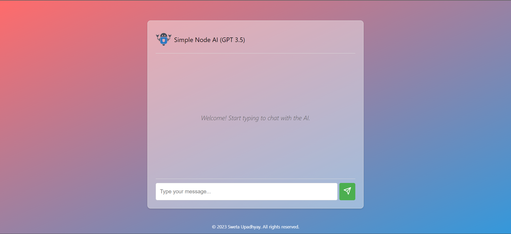
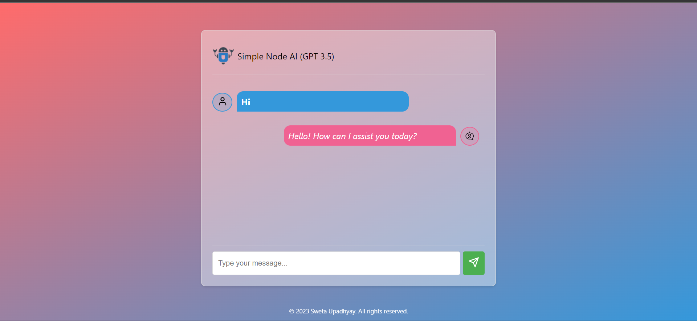

# Chat Interface with Node.js and GPT-3.5 🚀

Welcome to the Chat Interface project powered by Node.js and OpenAI's GPT-3.5! 🤖 This project allows you to interact with a simple AI model using a sleek and user-friendly chat interface. 🌐💬

## Overview 🌟

The Chat Interface project enables users to engage in conversations with an AI model based on OpenAI's powerful GPT-3.5. 🧠💡 The intuitive interface provides a seamless chatting experience, making it easy to communicate with the AI and receive thoughtful responses.

## Features 🚀

- **User-Friendly Interface**: A clean and modern chat interface for smooth communication. 💻📱
- **AI-Powered Responses**: Utilizes OpenAI's mighty GPT-3.5 for intelligent and context-aware replies. 🤯🤖
- **Responsive Design**: Ensures a consistent experience across various devices. 📐📲

## Getting Your OpenAI API Key 🚀

To use the GPT-3.5 model in this project, you'll need an API key from the OpenAI platform. Follow these steps to generate your API key:

1. **Sign In or Sign Up:**
   - If you already have an account, sign in to the [OpenAI platform](https://platform.openai.com/).
   - If you don't have an account, sign up for a new account.

2. **Navigate to API Section:**
   - Once you are signed in, navigate to the API section.

3. **Create a New API Key:**
   - Look for an option to create a new API key. This is usually found in the API settings or dashboard.

4. **Choose Permissions:**
   - When creating a new API key, you may need to choose the appropriate permissions. For most use cases, you'll want to grant the key permissions to access the GPT-3 API.

5. **Copy Your API Key:**
   - After creating the API key, you'll typically see it displayed on the platform. Copy the API key and keep it secure. Do not share it publicly or expose it in your code repositories.

6. **Store the API Key:**
   - It's a good practice to store your API key in a secure manner. You can use environment variables or a configuration file. In your project, you might have a `.env` file where you store sensitive information.

   Example using environment variables:
   ```env
   # .env file
   API_KEY=your-api-key-here

## Configuration ⚙️

Before running the project, make sure to set up your OpenAI API credentials.

1. Open the `.env` file.
2. Add your OpenAI API key: `API_KEY=your-api-key`.
3. Save the file.


## Getting Started 🛠️

Follow these steps to set up the Chat Interface on your local machine:

### Prerequisites
- [Node.js](https://nodejs.org/)
- [npm](https://www.npmjs.com/) (Node Package Manager)

### Installation
```bash
git clone [repository-url]
cd your-project
npm install
```

## Usage 🚦

1. Open the `index.html` file in your browser.
2. Start typing messages in the input box to interact with the AI.
3. Press Enter or click the send button to send your message.
4. Enjoy the intelligent responses generated by the GPT-3.5 model! 🎉🤩

## Technologies Used 💻

- **Node.js**: Server-side JavaScript runtime.
- **Express**: Web framework for Node.js.
- **OpenAI GPT-3.5**: State-of-the-art natural language processing model.

## Troubleshooting 🛠️

Encountering issues? Here are some common problems and solutions:

### 1. API Key Issues

**Problem:**
- **Issue:** API key not recognized or unauthorized.
- **Solution:** Double-check your API key and ensure that it has the necessary permissions. Also, make sure it's correctly stored in your project (e.g., in the `.env` file).

### 2. Node.js and npm Versions

**Problem:**
- **Issue:** Node.js or npm versions are incompatible.
- **Solution:** Ensure that you have compatible versions of Node.js and npm. You can check the recommended versions in your `package.json` file or the project documentation.

### 3. Project Dependencies

**Problem:**
- **Issue:** Missing or outdated dependencies.
- **Solution:** Run `npm install` to install/update project dependencies. Check for any error messages during the installation process.

### 4. Server Not Starting

**Problem:**
- **Issue:** Server fails to start.
- **Solution:** Check for error messages in the console. Ensure that all necessary configurations are correct. You can also try restarting the server.

### 5. Browser Compatibility

**Problem:**
- **Issue:** UI issues or unexpected behavior in the browser.
- **Solution:** Verify that you are using a modern and up-to-date browser. Clear the browser cache and try again.

### 6. OpenAI API Rate Limits

**Problem:**
- **Issue:** Exceeding API rate limits.
- **Solution:** Be mindful of the OpenAI API rate limits. If you encounter rate-limiting issues, consider optimizing your code to make fewer API requests or upgrade your OpenAI account for higher limits.

If you're still facing problems after trying the above solutions, feel free to [create an issue](https://github.com/sweta134/Simple-AI-/issues) on the project repository. Provide detailed information about the problem.

## Contribution Guidelines 🤝

Thank you for considering contributing to the Chat Interface project! Contributions are highly valued, and we appreciate your effort to improve this project.

### How to Contribute

1. Fork the Project: [Fork the repository](https://github.com/sweta134/Simple-AI-.git) to your GitHub account.
2. Create a Branch: Create a new branch for your feature or bug fix.
   ```bash
   git checkout -b feature/your-feature-name
   ```
3. Make Changes: Make your desired changes, add new features, or fix bugs.
4. Commit Changes: Commit your changes with a descriptive commit message.
   ```bash
   git commit -m "Add your commit message here"
   ```
5. Push to the Branch: Push your changes to your forked repository on GitHub.
   ```bash
   git push origin feature/your-feature-name
   ```
6. Create a Pull Request: Open a pull request from your forked repository to the original repository. Provide a detailed description of your changes.

## Acknowledgments 🙌

A special thanks to OpenAI for providing the incredible GPT-3.5 model that powers our AI responses.

## Contact 📬

Have questions or suggestions? Feel free to reach out to me on [LinkedIn](https://www.linkedin.com/in/sweta-upadhyay-369841196/) or [Email](mailto:upadhyaysweta17@example.com).

## Screenshots 📷

1. **Chat Interface**:
   


3. **Chat Functionality**:
   


